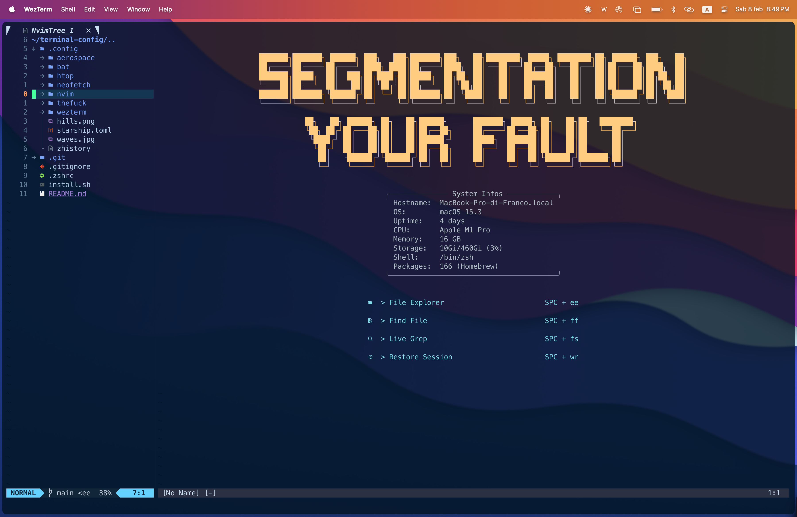
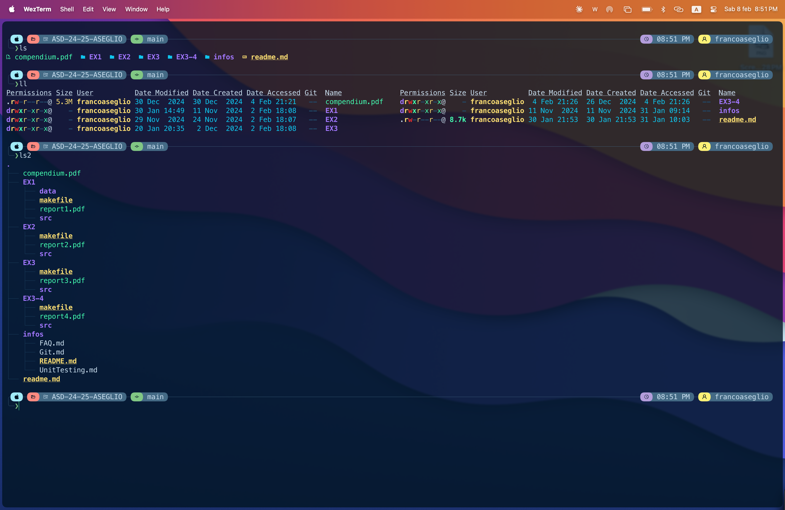
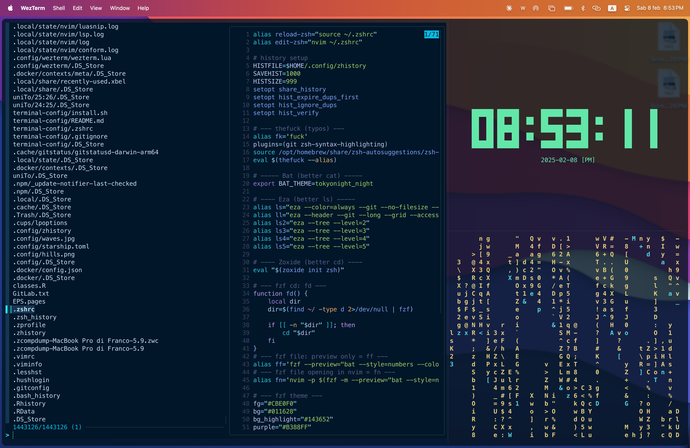
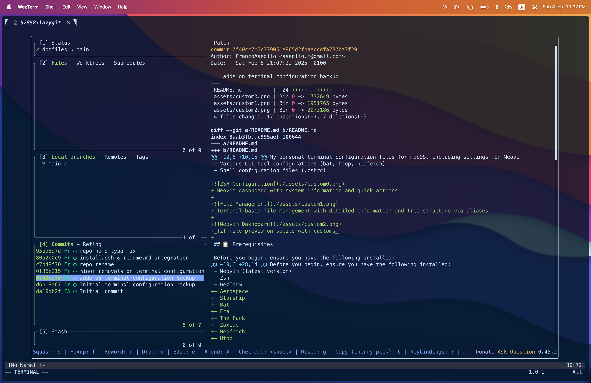

# Terminal Configuration

My personal terminal configuration files for macOS;  
providing a comprehensive development environment with Neovim, WezTerm, and essential CLI tools.
This setup aims to create a consistent, efficient, and pleasant terminal experience across different operating systems.

## 🚀 Features

- **Neovim Configuration**
  - Custom plugin setup for enhanced development
  - Language Server Protocol (LSP) integration
  - Syntax highlighting and code completion
  - File explorer and fuzzy finding
  - Git integration and status indicators
- **WezTerm Terminal Emulator**
  - Modern GPU-accelerated terminal
  - Custom keybindings and shortcuts
  - Split panes and tab management
  - Unicode and ligature support
- **Starship Prompt**
  - Git status integration
  - Command execution time
  - Python virtual environment indicator
  - Node.js version display
- **Development Tools**
  - bat: Modern replacement for cat
  - htop: Interactive process viewer
  - neofetch: System information display
  - aerospace: Window management for macOS


_Neovim dashboard featuring system information and quick actions_


_Terminal-based file management with detailed information and tree structure_


_FZF file preview with customized split panes_


_Lazy Git for easy access on terminal interface_

## 📋 Prerequisites

### Operating System Support

The installation script automatically detects your operating system and uses the appropriate package manager:

**macOS**

- Install Homebrew:

```bash
/bin/bash -c "$(curl -fsSL https://raw.githubusercontent.com/Homebrew/install/HEAD/install.sh)"
```

- Add to PATH (for Apple Silicon Macs):

```bash
echo 'eval "$(/opt/homebrew/bin/brew shellenv)"' >> ~/.zprofile
eval "$(/opt/homebrew/bin/brew shellenv)"
```

**Linux**
Supported package managers:

- apt (Debian/Ubuntu)
- dnf (Fedora/RHEL)
- pacman (Arch Linux)

### System Requirements

- Git for version control
- Curl for downloading dependencies
- Terminal emulator that supports UTF-8
- Optional: Compatible Nerd Font

## 🔧 Installation

### 1. Clone the Repository

```bash
git clone git@github.com:FrancoAseglio/dotfiles.git
cd ~/.dotfiles
```

### 2. Review the Configuration

Before installation, you can review:

- `.config/` directory structure
- Package list in install.sh
- Backup mechanism

### 3. Run Installation

```bash
chmod +x install.sh
./install.sh
```

### Installation Process

The script performs the following steps:

1. **Backup Creation**

   - Creates timestamped backup directory
   - Moves existing configurations to backup
   - Preserves your previous settings

2. **OS Detection**

   - Identifies operating system
   - Selects appropriate package manager
   - Verifies package manager availability

3. **Package Installation**

   - Installs missing required packages
   - Skips already installed packages
   - Reports installation status

4. **Symlink Creation**
   - Creates ~/.config directory if needed
   - Sets up symbolic links for all configurations
   - Maintains easy update capability

### Troubleshooting Installation

**Common Issues:**

1. Permission Denied

```bash
sudo chown -R $USER:$USER ~/.config
```

2. Debug Mode

```bash
bash -x install.sh
```

3. Package Manager Issues

```bash
# macOS
brew doctor

# Linux (Ubuntu/Debian)
sudo apt update

# Fedora
sudo dnf check-update

# Arch
sudo pacman -Sy
```

## 📦 Configuration Structure

```
.config/
├── nvim/                  # Neovim configuration
│   ├── init.lua           # Main configuration
│   ├── lua/               # Lua modules
│   └── plugins/           # Plugin configurations
├── wezterm/               # WezTerm terminal emulator
│   └── wezterm.lua        # Main configuration
├── bat/                   # Bat configuration
│   └── config             # Syntax highlighting settings
├── htop/                  # Process viewer
│   └── htoprc             # Layout and color settings
├── neofetch/              # System information
│   └── config.conf        # Display configuration
├── aerospace/             # Window manager
│   └── aerospace.toml     # Window management rules
└── starship.toml          # Shell prompt configuration
```

## 🔄 Maintaining Your Setup

### Updating Configurations

```bash
cd ~/.dotfiles
git pull
./install.sh
```

### Adding New Configurations

1. Add directory/file to `.config/`
2. Update `configs` or `files` array in install.sh
3. Add package name to `packages` array if needed
4. Run installation script

### Backup Management

- Backups are stored in `~/.config/backup_[timestamp]`
- Review and clean old backups periodically
- Keep at least one known working backup

## 🤝 Contributing

1. Fork the repository
2. Create a feature branch
3. Make your changes
4. Test the installation script
5. Submit a pull request

Guidelines:

- Follow existing code style
- Update documentation
- Test on both macOS and Linux
- Include relevant screenshots

## 📚 Resources

- [Neovim Documentation](https://neovim.io/doc/)
- [WezTerm Reference](https://wezfurlong.org/wezterm/)
- [Starship Configuration](https://starship.rs/)
- [Homebrew Guide](https://docs.brew.sh/)
- [Aerospace Documentation](https://nikitabobko.github.io/AeroSpace/guide)

## ⭐️ Acknowledgments

Thanks to:

- Neovim community for plugins and inspiration
- WezTerm developers for an excellent terminal
- Starship contributors for a great prompt
- The open source community
